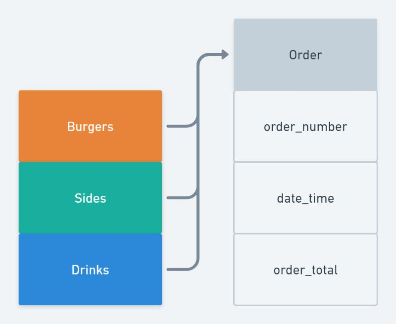

## Table of Contents

* [Description](#description)
* [User Stories](#user-stories)
* [Structure](#structure)
    * [App Flow](#app-flow)
    * [Data Schema](#data-schema)
* [Models](#models)
* [Features](#features)

## Description

For my project, I have created an ordering system for a burger restaurant called ***Brad's Burgers***.

The idea of the ordering system is that when the customer arrives to the restaurant, they will make their order on a terminal.

The customer will first see the home screen which will prompt them to ***Place Order***.

After ***Place Order*** has been selected, the screen will show a list of categories to choose from, ***Burgers***, ***Sides*** and ***Drinks***.

After selecting a category, the customer will have a choice of selecting from a list of the chosen category.

When the customer has finished with their order, they will see a table on the order page what they have ordered and the total cost.

The customer can remove items from the order list.

When they are happy with the order, the customer can select the ***Finish Order*** button which will dirict them to a final page displaying their order number.

The restaurant will then be able to see the orders that have been made along with the order number.

When the order is complete, the restaurant can mark the order as complete.

[Back to top](#table-of-contents)

------

## User Stories

| ***As a*** | ***I want to be able to*** | ***so that I*** |
| ------ | ------ | ------|
| customer | select from a number of categories | can order a meal |
| customer | view what I have ordered | can see the total price before finishing my order |
| customer | select items from my order | can remove item from the order list |
| restaurant worker | login to an account | can edit product information |
| restaurant worker | view orders that have been made along with the order number | can fulfill an order correctly |
| restaurant worker | mark which orders are complete | don't make the same order twice |

[Back to top](#table-of-contents)

------

## Structure

### App Flow

### ***Customer***

### ***Admin***

------

### Data Schema

### ***Products***

### ***Orders***

[Back to top](#table-of-contents)

------

## Models

***Products***

| Name | Key | Type | Other Details |
| ---- | ---- | ---- | ----|
| name | | CharField | max_length=50 |
| price | | DecimalField | max_digits=6, decimal_places=2 |
| image_url | | URLField | max_length=80 |

***Orders***

| Name | Key | Type | Other Details |
| ---- | ---- | ---- | ----|
| number | | CharField | max_length=3 |
| name | | CharField | max_length=100 |
| total | | DecimalField | max_length=10, decimal_places=2, default=0 |
| date | | DateTimeField | auto_now_add=True |

[Back to top](#table-of-contents)

------

## Features

### Existing Features
* Customer can order their meal by selecting from a number of categories
* Customer can view what they have ordered with the price of each item and a total price before finishing their order
* Customer can remove item from order list
* Customer will be given an order number after finishing their order
* Restaurant can view what orders have been made along side the order number in a dashboard
* Restaurant can mark which orders have been completed in the dashboard
* Restaurant can edit and remove items in product management

### Future Features
* Customer can make a payment with debit/credit card after completing order
* Customer can register their details and order/pay online
* Customer can have the option for home delivery
* Restaurant can show what items are out of stock
* Customer can customize their burger by selecting what they want on it from a number of sub-categories

[Back to top](#table-of-contents)

------
